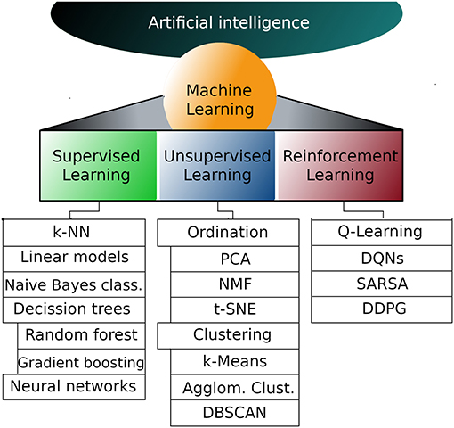

## 💡 Introducción

> **“Los sistemas expertos abrieron el camino de la IA simbólica, y el machine learning amplió sus horizontes con datos.”**

- 🧩 **Sistemas expertos** → Reglas explícitas
- 📊 **Machine Learning** → Aprende patrones de los datos
- 🌍 **Combinación híbrida** → Base de la IA moderna

---

## De los Sistemas Expertos al Machine Learning

- La **IA simbólica** de los años 60–80 se centraba en **reglas y conocimiento explícito**.  
- Los **Sistemas Expertos** (como MYCIN o DENDRAL) fueron pioneros en resolver problemas reales.  
- Limitaciones: rigidez de reglas, dificultad de mantener bases de conocimiento, poca adaptabilidad.  
- Surge la necesidad de un enfoque que **aprenda de los datos** en lugar de depender solo de expertos humanos.  

---

## 🤖 ELIZA: el primer chatbot (1966)

- 📜 Basado en reglas *SI–ENTONCES*
- 💬 Simulaba un psicoterapeuta
- 🚧 Limitado: sin comprensión real
<p> 
  <a href="https://www.masswerk.at/elizabot/eliza.html" target="_blank">Abrir ELIZA</a>
</p>

```{python}
# Mini-ELIZA en Python
rules = {
    "hola": "Hola, ¿cómo estás hoy?",
    "triste": "¿Por qué crees que estás triste?",
    "madre": "Háblame más de tu familia.",
}

entrada = "estoy triste"
respuesta = None
for clave in rules:
    if clave in entrada:
        respuesta = rules[clave]

print(respuesta or "Cuéntame más...")
```

---

## Sistema Experto MYCIN

::: {#fig-mycindemo}



- **Origen**: creado en la Universidad de Stanford (años 70) como pionero en sistemas expertos médicos.  
- **Propósito**: diagnosticar **infecciones bacterianas en la sangre** y sugerir tratamientos con antibióticos adecuados.  
- **Método**: utilizaba una **base de reglas de producción** (del tipo “SI… ENTONCES…”) para razonar como un especialista.  
- **Innovación**: introdujo los **factores de certeza**, permitiendo manejar la incertidumbre típica de la práctica clínica.  
- **Interacción**: dialogaba con el médico haciendo preguntas específicas para recolectar síntomas y antecedentes del paciente.  
- **Transparencia**: podía **explicar paso a paso por qué llegaba a una conclusión**, algo clave para generar confianza en un entorno médico.  
- **Legado**: aunque nunca se usó clínicamente por temas legales y éticos, marcó un antes y un después en la **Inteligencia Artificial aplicada a la medicina**.  

In @fig-mycindemo se observa la demostración de 1988, donde MYCIN razona en tiempo real frente a un especialista.  

:::


---

## 📐 Representación del Conocimiento

- 🔗 **Lógica proposicional**: Verdadero/Falso
- ➡️ **Reglas de inferencia**: "Si fiebre → entonces posible gripe"
- 🧠 **Redes semánticas**: relaciones entre conceptos

```{mermaid}
flowchart LR
    A[Fiebre] --> B[Gripe]
    A --> C[COVID]
    B --> D[Tratamiento: Paracetamol]
```

---

## El Punto de Quiebre

- Aumento masivo de datos en los 80–90.  
- Aparición de hardware más potente.  
- Críticas a la “IA simbólica”: demasiado rígida.  
- Giro hacia la **IA conexionista y estadística**.  
- Pregunta clave:  
  *¿Y si dejamos que la máquina aprenda directamente de los datos?*  

---

## Machine Learning

- **Enfoque**: algoritmos que **aprenden patrones** a partir de datos.  
- **Ejemplos tempranos**:  
  - Redes Neuronales (Perceptrón, Backpropagation).  
  - Árboles de decisión.  
  - Métodos estadísticos (regresión, Bayesianos).  
- **Ventajas**:  
  - Capacidad de generalizar.  
  - Adaptación a entornos cambiantes.  
  - Reducción de la dependencia de expertos humanos para definir reglas.  

---

## 🔬 Fundamentos de Machine Learning

- 🎯 Objetivo: aprender de **datos**, no solo reglas
- 📊 Tipos:
  - **Supervisado** (con etiquetas)
  - **No supervisado** (patrones ocultos)
  - **Refuerzo** (interacción con entorno)

    {fig-align="center" width="400"}

---

# 🧮 Aprendizaje Supervisado

## 📉 Concepto
- Entrenamiento con **pares (X, y)**.
- Ejemplo: predecir precios de casas.
- Fases:
  1. Entrenar modelo.
  2. Validar con datos no vistos.
  3. Generalizar al mundo real.

---

## 🔢 Regresión Lineal
- Modelo:

$$\hat{y} = \beta_0 + \beta_1x_1 + ... + \beta_nx_n$$

- Uso: predicción de valores continuos.
- Ejemplo: precio de vivienda.

```{python}
from sklearn.linear_model import LinearRegression
X = [[50],[60],[70],[80]]
y = [150,200,250,300]
model = LinearRegression().fit(X,y)
print(model.predict([[75]]))
```

---

## 🔀 Regresión Logística
- Modelo probabilístico para clasificación binaria.

$$P(y=1|x) = \frac{1}{1+e^{-(\beta_0+\beta_1x_1+...+\beta_nx_n)}}$$

- Ejemplo: detectar si un correo es spam.

```{python}
from sklearn.linear_model import LogisticRegression
X = [[0],[1],[2],[3]]
y = [0,0,1,1]
logreg = LogisticRegression().fit(X,y)
print(logreg.predict([[1.5]]))
```

---

## 🌳 Árboles de Decisión
- Modelo jerárquico de decisiones.
- Fácil de interpretar.
- Riesgo: sobreajuste.

```{python}
from sklearn.tree import DecisionTreeClassifier
X = [[0],[1],[2],[3]]
y = [0,0,1,1]
tree = DecisionTreeClassifier().fit(X,y)
print(tree.predict([[2.5]]))
```

---

## 🌲 Bosques Aleatorios (Random Forest)
- Conjunto de árboles de decisión.
- Mejora estabilidad y precisión.
- Usa **bagging** (bootstrap aggregation).

---

## 📏 Máquinas de Vectores de Soporte (SVM)
- Encuentran el **hiperplano óptimo** que separa clases.
- Útiles en espacios de alta dimensión.

```{python}
from sklearn.svm import SVC
X = [[0,0],[1,1],[1,0],[0,1]]
y = [0,0,1,1]
svm = SVC(kernel='linear').fit(X,y)
print(svm.predict([[0.8,0.8]]))
```

---

## 🧠 Redes Neuronales
- Inspiradas en el cerebro humano.
- Capaces de aprender representaciones complejas.
- Ejemplo: reconocimiento de imágenes.

<iframe src="https://docs.google.com/presentation/d/e/2PACX-1vTrRe7oAasHwV508diAKHI88h5AmFS6PLFBddXjgtY41UVYJdYMx09VRYg0xvbASCz1r5wE4XvEoGTe/pubembed?start=false&loop=false&delayms=3000" frameborder="0" width="1280" height="749" allowfullscreen="true" mozallowfullscreen="true" webkitallowfullscreen="true"></iframe>

---

# 🔍 Aprendizaje No Supervisado

## 📉 Concepto
- Sin etiquetas → el modelo encuentra estructura.
- Ejemplo: segmentación de clientes.

---

## 🔘 K-Means Clustering
- Divide datos en **k clusters**.
- Minimiza la distancia intra-cluster.

```{python}
from sklearn.cluster import KMeans
import numpy as np
X = np.array([[1,2],[1,4],[10,2],[10,4]])
kmeans = KMeans(n_clusters=2, random_state=0).fit(X)
print(kmeans.labels_)
```

---

##  K-Means

El algoritmo k-Means es uno de los algoritmos de agrupación más comunes. Este algoritmo divide un conjunto de $n$ observaciones en $k$ clústers, donde cada observación pertenece al clúster con la media más cercana.

**Formulación matemática:**

El algoritmo k-Means minimiza la suma de las distancias cuadradas entre los puntos y sus respectivos centroides del clúster.

$$
\underset{S}{\text{min}} \sum_{i=1}^{k} \sum_{\mathbf{x} \in S_i} \left\| \mathbf{x} - \mu_i \right\|^2
$$

donde:
- $S$ son los $k$ clústers,
- $S_i$ es el $i^{th}$ clúster,
- $\mu_i$ es el centroide del $i^{th}$ clúster.

---

## Agrupación de K-Means
K-Means es fácilmente el algoritmo de agrupación en clústeres más popular debido a su simplicidad. En última instancia, asume que cuanto más cerca están los puntos de datos entre sí, más similares son. Así es como se hace:

1. Elija el número de grupos K
2. Establecer aleatoriamente la posición inicial de cada centroide
3. Asigne cada punto de datos al centroide más cercano usando la medida de distancia
4. Restablezca cada ubicación del centroide usando la media de los puntos de datos asignados a cada grupo
5. Vuelva al paso 3 y repita hasta que ningún punto de datos individual cambie de grupo

---

## ¿Cómo encuentra el número óptimo de, K ?

Uno de los pasos más difíciles en el agrupamiento es determinar el número óptimo de conglomerados, K, para agrupar los datos, y no existe una respuesta "correcta".

El enfoque más común se conoce como "el método del codo". Esencialmente, ejecuta el agrupamiento de K-Means en todo el conjunto de datos para varios valores de K y calcula la suma total de errores cuadráticos (SSE) para cada K.

Es importante graficar los resultados. El gráfico se asemeja a un brazo y, como sugiere el nombre, el valor de K donde la pendiente cambia más (es decir, el codo) se considera el número óptimo de conglomerados. El objetivo no es encontrar la K que minimice la distancia total al cuadrado, sino la K que ve rendimientos decrecientes cuando K aumenta.

---

**Ejemplo:**
Utilizamos un conjunto de datos sobre clientes de un centro comercial y los clasificaremos por ingreso y por score de gasto.

## 📊 Visualización de Clientes (Mall Customers)


Cargamos el dataset y graficamos la relación entre **ingresos anuales** y **puntaje de gasto**.


```{python}
import numpy as np
import matplotlib.pyplot as plt
import pandas as pd


# Cargar dataset (asegúrate de que esté en la misma carpeta que este archivo .qmd)
df = pd.read_csv("Mall_Customers.csv")


# Mostrar primeras filas
df.head()
```


---


## ✨ Scatterplot: Ingresos vs Gasto


```{python}
X = df.iloc[:, [3, 4]].values


# Gráfico de dispersión
ax = df.plot.scatter(x="Annual Income (k$)", y="Spending Score (1-100)",
c="blue", alpha=0.6, figsize=(6,5), grid=True)
plt.title("Mall Customers - Income vs Spending Score")
plt.show()
```

---

## 📊 K-Means: Método del Codo

```{python}
from sklearn.cluster import KMeans
import matplotlib.pyplot as plt

wcss = []
for i in range(1, 11):
    kmeans = KMeans(n_clusters=i, init="k-means++", max_iter=300, random_state=0)
    kmeans.fit(X)
    wcss.append(kmeans.inertia_)

plt.plot(range(1, 11), wcss, marker='o')
plt.title("Método del Codo")
plt.xlabel("Número de K")
plt.ylabel("WCSS (Within-Cluster Sum of Squares)")
plt.grid(True)
plt.show()
```


---


## 📉 Interpretación del Método del Codo


- El **punto de inflexión** en la curva indica el número óptimo de clusters.
- Evita tanto **subsegmentar** (muy pocos grupos) como **sobresegmentar** (demasiados grupos).
- En este dataset, suele aparecer alrededor de **K=5**.

En nuestro ejemplo, el método del codo devuelve un valor de 3 como el número óptimo de clústeres (y sabemos que esto es correcto según los datos reales).

---

## ¿Cuál es la medida de la distancia?

El algoritmo K-Means utiliza la medida de distancia euclidiana . Esto significa que la medida de la distancia alrededor de cada centro de grupo es 'circular'. Lo que esto significa es que la importancia de cada dimensión es igual, de ahí el término 'circular' .

$d_{a, b}=\sqrt{\sum_{j=1}^J\left(a_j-b_j\right)^2}$

donde J es el número de dimensiones.

Como en nuestro ejemplo, aplicando esta fórmula a dos dimensiones, tomamos:

$d_{a, b}=\sqrt{\left(a_1-b_1\right)^2+\left(a_2-b_2\right)^2}$

---

## 🎯 K-Means con K=5

Entrenamos el modelo con **5 clusters** usando el método de inicialización *k-means++* y más iteraciones para estabilidad.

```{python}
from sklearn.cluster import KMeans

kmeans = KMeans(n_clusters=5, init="k-means++", max_iter=1000, n_init=100, random_state=0)
y_kmeans = kmeans.fit_predict(X)
y_kmeans
```
---

## 📊 Segmentación de Clientes (K=5)

Visualizamos los 5 clusters encontrados con K-Means en el dataset **Mall Customers**.

```{python}
import matplotlib.pyplot as plt

plt.scatter(X[y_kmeans == 0, 0], X[y_kmeans == 0, 1], s=50, c="red", label="Cautos")
plt.scatter(X[y_kmeans == 1, 0], X[y_kmeans == 1, 1], s=50, c="blue", label="Estándar")
plt.scatter(X[y_kmeans == 2, 0], X[y_kmeans == 2, 1], s=50, c="green", label="Objetivo")
plt.scatter(X[y_kmeans == 3, 0], X[y_kmeans == 3, 1], s=40, c="orange", label="Economía salarial")
plt.scatter(X[y_kmeans == 4, 0], X[y_kmeans == 4, 1], s=50, c="cyan", label="Conservadores")

# Centroides
plt.scatter(kmeans.cluster_centers_[:, 0], kmeans.cluster_centers_[:, 1], 
            s=100, c="yellow", marker="X", label="Centroides")

plt.title("Cluster de Clientes")
plt.xlabel("Ingresos anuales en miles")
plt.ylabel("Puntuación de gasto (1-100)")
plt.legend()
plt.grid(True)
plt.show()
```

---


## 🧬 Clustering Jerárquico
- Algoritmo de agrupamiento que construye una jerarquía de clusters.
- Representa las relaciones en un **dendrograma** que muestra cómo se van fusionando o dividiendo los grupos.
- Dos enfoques principales:
- **Aglomerativo (bottom-up):** cada observación inicia como un cluster individual y se van fusionando hasta formar un único grupo.
- **Divisivo (top-down):** comienza con un único cluster y se va dividiendo recursivamente.
- Permite elegir el nivel de corte en el dendrograma para definir el número final de clusters.
- Muy útil cuando queremos comprender la estructura jerárquica y similitudes progresivas entre datos.


---


## 🔻 PCA (Análisis de Componentes Principales)
- Técnica estadística para **reducir la dimensionalidad** de los datos conservando la mayor cantidad de información posible.
- Busca nuevas variables (componentes principales) que son combinaciones lineales de las originales.
- Ordena los componentes según la **varianza explicada**, es decir, cuánta información aportan.
- Beneficios:
- Elimina redundancia cuando hay alta correlación entre variables.
- Facilita la visualización de datos en 2D o 3D.
- Reduce el ruido y mejora la eficiencia de algoritmos posteriores.
- Limitación: los componentes pueden ser difíciles de interpretar porque son combinaciones de variables originales.


--- (Análisis de Componentes Principales)
- Reduce la dimensionalidad.
- Mantiene máxima varianza.
- Útil en visualización y preprocesamiento.


---


## 🌐 DBSCAN
- Detecta clusters de **forma arbitraria**.
- Identifica puntos como **núcleo, frontera, ruido**.
- Excelente para detección de anomalías.


---


## 📊 Modelos de Mezcla Gaussiana (GMM)
- Supone que los datos provienen de una combinación de varias distribuciones gaussianas.
- Permite asignar **probabilidades de pertenencia** a cada cluster.
- Más flexible que K-Means porque captura clusters de diferentes tamaños y formas.


```{python}
from sklearn.mixture import GaussianMixture


gmm = GaussianMixture(n_components=3, random_state=0)
gmm.fit(X)
labels = gmm.predict(X)
labels[:10]
```


---


## 🔍 Aprendizaje No Supervisado

- No requiere etiquetas → el modelo encuentra estructuras ocultas en los datos.
- Ejemplos: 
  - Segmentación de clientes
  - Reducción de dimensionalidad (PCA)
  - Detección de anomalías (DBSCAN)

👉 Explora este tema en el siguiente cuaderno interactivo en Google Colab:

[📓 Abrir en Google Colab](https://colab.research.google.com/drive/1YGY0YJcn4tUFElP-fvQYVgcU-Xfz9dy7?usp=sharing){target=_blank .btn .btn-primary}

---


# 📊 Conceptos Clave

## ⚖️ Underfitting y Overfitting
- Underfitting → modelo demasiado simple.
- Overfitting → modelo demasiado complejo.
- Objetivo: equilibrio sesgo–varianza.

---

## 📉 Bias y Varianza
| 📌 | Sesgo (Bias) | Varianza |
|----|--------------|----------|
| Definición | Error por simplicidad excesiva | Error por sensibilidad excesiva |
| Ejemplo | Línea recta para datos curvos | Modelo que memoriza ruido |
| Solución | Aumentar complejidad | Regularizar |

---

## 🛠️ Regularización
- Ridge (L2): reduce magnitudes.
- Lasso (L1): selecciona variables.
- Elastic Net: combina ambas.

---

## 🌍 Generalización
- Validación cruzada.
- Conjunto de prueba.
- Evaluar R² y RMSE.

---

# 🏭 Aplicaciones Reales
- 🏥 Medicina: diagnóstico.
- 💳 Finanzas: detección de fraudes.
- 📸 Visión por computadora.
- 🛒 Marketing: segmentación de clientes.

---

## 🔗 Conexión SE + ML
- Sistemas expertos = reglas explícitas.
- ML = patrones desde datos.
- Hoy: sistemas híbridos.

---

## 🎓 Conclusión
- Sistemas expertos: pioneros.
- ML: amplió horizontes.
- Futuro: integración.

---

## ❓ Preguntas

{fig-align="center" width="300"}